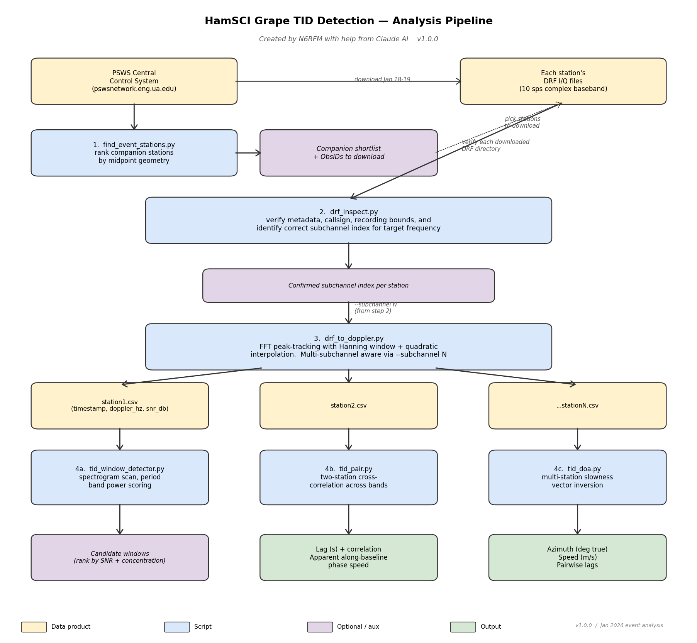

# psws-drf-tid-tools

**A Python pipeline for analyzing Traveling Ionospheric Disturbances (TIDs)
from HamSCI Grape Digital RF I/Q recordings.**

## Travelling Ionospheric Disturbance (TID) 

A wave-like disturbance in the ionosphere that propagates over long distances, often caused by atmospheric or geomagnetic events. TIDs propagate towards the equator during storms, and can disrupt GNSS/GPS navigation, radio communications, and satellite operations.  

## What this toolkit is intended for

Given Doppler-vs-time data from a several HamSCI Grape DRF or WSPRDaemon (https://hamsci.org) stations
recording the same WWV carrier, this toolkit lets you:

- find which other stations were on the air during your event of interest
- inspect a Digital RF (DRF) recording and identify the correct subchannel
- extract Doppler-vs-time CSVs from raw I/Q
- render annotated spectrograms
- detect candidate TID windows automatically
- run two-station cross-correlation or full multi-station
  direction-of-arrival inversion
- visualize the result as stacked Doppler traces and array-geometry maps

The reference event is the **X1.9 solar flare and subsequent LSTID of
19 January 2026**, analyzed end-to-end with this toolkit. The final
case-study writeup of that analysis is here https://spectrogram-docs.readthedocs.io/en/latest/index.html.

---

## Quickstart

```bash
git clone https://github.com/N6RFM/psws-drf-tid-tools.git
cd psws-drf-tid-tools
pip install -r requirements.txt
pip install -r requirements-optional.txt   # for nicer maps
```
### Recommended: use a virtual environment

The toolkit's dependencies (particularly `digital_rf`, `cartopy`, and
older `numpy`/`scipy` constraints from upstream HamSCI tools) can
conflict with packages already installed on your system. A Python
virtual environment isolates them so they don't interfere with anything
else.

On Linux or macOS:

```bash
# Create a venv inside the repo directory
python3 -m venv .venv

# Activate it (you'll see (.venv) in your prompt)
source .venv/bin/activate

# Now install dependencies INSIDE the venv
pip install -r requirements.txt
pip install -r requirements-optional.txt   # for nicer maps

# Run any toolkit script as usual
python3 drf_inspect.py --version
```
When you're done working with the toolkit, deactivate the venv:

```bash
deactivate
```

To resume work later, just `cd` into the repo and run `source .venv/bin/activate`
(or the equivalent for your shell) again — no need to reinstall anything.

If you don't want to use a venv, you can install dependencies directly
into your user Python with `pip install --user -r requirements.txt`,
or system-wide with `sudo pip install -r requirements.txt` (not
recommended on modern Linux distributions where it can interfere with
system packages).

## Analysis Workflow

```bash
# 1. Identify the TID region of interest at your own station or other
#    reference station by visual inspection of its 24-hour Doppler
#    spectrogram. The window you pick here drives every later step.
python3 drf_spectrogram.py ./n6rfm \
    --output n6rfm_survey.png \
    --ylim=-2,2 \
    --callsign "N6RFM/5" --grid "EM12jw"

# 2. Find companion stations
python3 find_event_stations.py --date 2026-01-19 \
    --my-lat 32.94 --my-lon -97.21 --my-call "N6RFM/5"

# 3. After downloading the DRF tarballs from PSWS, verify each
python3 drf_inspect.py --all . --frequency 10

# 4. Extract Doppler CSV from each station's DRF
python3 drf_to_doppler.py ./n6rfm \
    --start 2026-01-19T00:00:00 --end 2026-01-19T01:15:00 \
    --decim-seconds 10 --subchannel 0 \
    --output n6rfm.csv --plot n6rfm.png

# (repeat for each station)

# 5. Build the DOA event config interactively
python3 tid_doa_config.py --output event.json --scan .

# 6. Run the direction-of-arrival inversion
python3 tid_doa.py event.json

# 7. Make the report figures
python3 drf_spectrogram.py ./n6rfm --output spectrogram.png \
    --annotate "00:00,01:15,4-station DOA window"
python3 tid_stack_plot.py --config event.json --output stack.png
python3 tid_map.py --config event.json --output map.png \
    --azimuth-toward 215 --speed 666
```

## Documentation

All documentation for using the toolkit lives in [`docs/`](docs/):

- **[`TUTORIAL.md`](docs/TUTORIAL.md)** — full narrative walkthrough of a
  TID analysis from start to finish, using the 19 Jan 2026 event as a
  worked example. **Start here if you're new.**
- **[`COOKBOOK.md`](docs/COOKBOOK.md)** — task-oriented recipes for
  everyday use. The reference once you know the pipeline.
- **[`TROUBLESHOOTING.md`](docs/TROUBLESHOOTING.md)** — failure modes
  and how to diagnose them.
- **[`METHODOLOGY.md`](docs/METHODOLOGY.md)** — the mathematical and
  signal-processing details behind the toolkit.

The completed case-study writeup of the 19 Jan 2026 event is here https://spectrogram-docs.readthedocs.io/en/latest/index.html.

---

## What's in this repo

```
psws-drf-tid-tools/
├── README.md
├── LICENSE                     MIT
├── CHANGELOG.md
├── CITATION.cff
├── requirements.txt
├── requirements-optional.txt
├── drf_spectrogram.py          step 1: identify region of interest (also step 7: annotated figures)
├── find_event_stations.py      step 2: companion-station discovery
├── drf_inspect.py              step 3: verify metadata + subchannel
├── drf_to_doppler.py           step 4: extract Doppler CSV from I/Q
├── tid_window_detector.py      step 4 alt: automatic TID-window detection
├── tid_pair.py                 step 5: two-station cross-correlation
├── tid_doa_config.py           step 5 helper: build DOA config interactively
├── tid_doa.py                  step 6: multi-station DOA inversion
├── tid_stack_plot.py           step 7: stacked Doppler comparison
├── tid_map.py                  step 7: array geometry map
├── examples/
│   └── event_20260119.json     reference 4-station DOA config
└── docs/
    ├── TUTORIAL.md             full narrative walkthrough
    ├── COOKBOOK.md             task-oriented recipes
    ├── TROUBLESHOOTING.md      failure modes and diagnoses
    ├── METHODOLOGY.md          math + signal processing details
    ├── pipeline_flow.png       pipeline diagram
    └── pipeline_flow.pdf
```

Every script accepts `--help` and `--version`. Most scripts have a long
docstring at the top with full motivation, parameter guidance, and
worked examples.

---

## Pipeline overview



The blue boxes are scripts in this repo; the yellow boxes are data
products. `drf_spectrogram.py` lets you see the wave in your own data;
`find_event_stations.py` picks the companions; `drf_inspect.py`
verifies the downloads; `drf_to_doppler.py` reduces the raw I/Q to a
Doppler-vs-time CSV; `tid_pair.py` or `tid_doa.py` solves for the wave
direction.

---

## Dependencies

Core (required):
- Python 3.10 or newer
- `digital_rf` 2.6+ (MIT Haystack Observatory)
- `numpy`, `scipy`, `pandas`, `matplotlib`
- `requests`, `beautifulsoup4` (for `find_event_stations.py`)

Optional:
- `cartopy` for nicer `tid_map.py` output with state/country outlines

---

## License

MIT. See [LICENSE](LICENSE).

You can use, modify, and redistribute these tools freely, including in
commercial products. The MIT requirement is just that you include the
copyright notice.

---

## Citation

If you use this toolkit in a publication, please cite it. The
[CITATION.cff](CITATION.cff) file lets GitHub generate citations
automatically (look for the "Cite this repository" link in the sidebar),
or use:

> Mattaliano, R. (N6RFM). 2026. *psws-drf-tid-tools: a Python pipeline
> for analyzing Traveling Ionospheric Disturbances from HamSCI Grape
> Digital RF I/Q recordings.* Version 1.0.0.
> https://github.com/N6RFM/psws-drf-tid-tools

---

## Acknowledgments

- Gwyn Griffiths (G3ZIL) for mentoring and constructive feedback
- The developers of the HamSCI / PSWS infrastructure https://hamsci.org/
- Bill Engelke (AB4EJ), University of Alabama, for the original DRF processing and spectrogram
  plotting code https://github.com/HamSCI/DRF_processing
- MIT Haystack Observatory for the Digital RF format https://github.com/MITHaystack/digital_rf
- The operators of every Grape and WSPRDaemon DRF station whose data made this analysis possible

The toolkit was developed collaboratively with Anthropic's Claude AI.

---

## Contact

Bob Mattaliano (N6RFM) — n6rfm1@gmail.com

Issues and pull requests welcome on
[GitHub](https://github.com/N6RFM/psws-drf-tid-tools).
