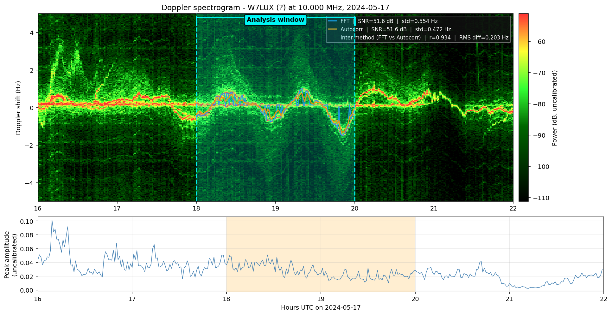
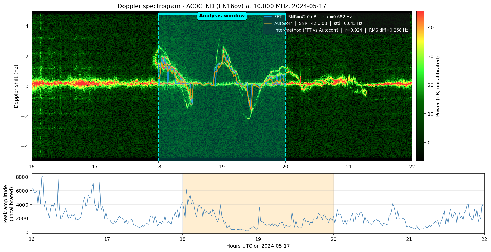
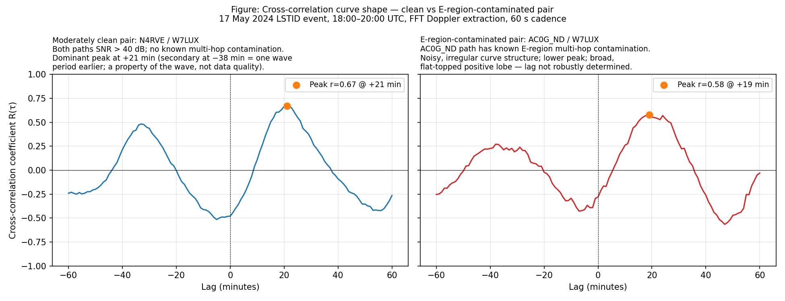

# Methodology

The mathematical and signal-processing details behind the toolkit. For
practical "how to use it" guidance, see the [workflow tutorial](../WORKFLOW_TUTORIAL.md) and
[cookbook](COOKBOOK.md).

---

## The physical setup

A HamSCI Grape DRF station receives a time-signal carrier on the HF bands, e.g., WWV from Fort
Collins, CO, on one or more standard frequencies (2.5, 5, 10, 15, 20,
25 MHz). The time signal transmitter is fixed in space and time; the carrier is
extraordinarily stable (10⁻¹² level). Any apparent Doppler shift seen
at the receiver is therefore caused by motion in the **ionospheric
reflection point** — the F-region patch that bounced the signal from
WWV to the receiver.

The signal arrives at the receiver after one bounce off the F-region
(single-hop propagation). The bouncing point lies approximately at the
**great-circle midpoint** between transmitter and receiver, at an
altitude of ~250 km. When a TID passes through this region, the local
electron density changes, which shifts the reflection height, which
appears at the receiver as a Doppler frequency shift.

For a TID of horizontal phase speed `v` propagating in direction `θ`,
the apparent Doppler at a station with midpoint at position `r` arrives
delayed relative to a reference station with midpoint at `r_0` by:

```
τ = (r - r_0) · ŝ / v
```

where `ŝ` is the unit vector in the wave's direction of motion.
Equivalently, defining the slowness vector `s = ŝ/v`:

```
τ = (r - r_0) · s
```

This is the equation the toolkit inverts to extract `s` (and hence `v`
and `θ`) from observed pairwise lags.

---

## Step 1: Doppler extraction

The raw DRF I/Q stream is complex baseband, sampled at 10 Hz. The WWV
carrier sits within ±5 Hz of zero after baseband mixing.

Four extraction methods are available, in order of recommended preference:

| Method | How | Best for |
|--------|-----|----------|
| **Anchor-guided cwt-prophet** | Interactive: Prophet auto-trace + user anchor corrections, E=accept | All events, especially E-region contamination |
| **wave-fit** | Interactive: user clicks cycle points, sine fit | Clean signals with ≥0.5 cycles visible (≥1.5 recommended) |
| **autocorr** | Automated: lag-1 complex autocorrelation | Clean signals, G3ZIL validation |
| **fft** | Automated: bin-peak tracker | Clean signals, fast survey |

The FFT bin-peak method is described below. The anchor-guided
cwt-prophet and wave-fit methods bypass the automated
bin-peak tracker — the user defines the Doppler trace
directly from the spectrogram.

For each output sample of duration `T = decim_seconds` (FFT method):

1. Read `N = 10 × T` complex I/Q samples.
2. Apply a Hanning window: `x_w[k] = x[k] · 0.5(1 - cos(2πk/N))`.
3. FFT: `X[m] = Σ_k x_w[k] · exp(-2πi·mk/N)`.
4. Find the maximum-magnitude bin `m*` within ±5 Hz of zero.
5. Quadratic interpolation for sub-bin precision:
   ```
   f_peak = m* · (fs/N) + 0.5 · (|X[m*-1]| - |X[m*+1]|) /
            (|X[m*-1]| - 2|X[m*]| + |X[m*+1]|)
   ```
   Gives ~0.01 Hz precision on a 10-second block at 10 Hz sample rate.
6. SNR estimate: `20 · log10(|X[m*]| / median(|X|))` dB. Median is
   robust to spurious in-band tones.

The output is a CSV with columns `timestamp_utc, doppler_hz, snr_db`
at the chosen cadence.

This is a **bin-peak tracker** rather than a phase-locked loop. Each
block is independent, so brief signal dropouts don't propagate as
tracking errors. The cost is some temporal smoothness; SNR > 30 dB
gives ~0.01–0.02 Hz block-to-block noise on the Doppler estimate.

---

## Step 1b: Visual inspection with drf_spectrogram.py --overlay

Before committing to a cross-correlation, use `drf_spectrogram.py` with
`--overlay` to visually validate the extracted Doppler trace against the
raw spectrogram. This step catches data quality issues and E-region
contamination that are invisible in the Doppler CSV alone.

### What to look for

A TID signal appears in the spectrogram as a **slow, sinusoidal,
wave-like bright ridge** drifting above and below 0 Hz with a period
of 20–90 minutes. E-region contamination appears as a **flat, bright
band near 0 Hz** running alongside or underneath the TID wave. When
both are present, the extracted Doppler is a weighted mixture of the
two — and the two extraction methods (FFT and autocorr) may weight
them differently.

### Overlay usage

```
python drf_spectrogram.py ./station_dir --output out.png \
    --start HH:MM --end HH:MM \
    --annotate "HH:MM,HH:MM,Analysis window" \
    --overlay "station_fft.csv:FFT" \
    --overlay "station_autocorr.csv:Autocorr:#FF9800"
```

### Interpreting the legend metrics

Each overlay trace shows four metrics in the legend:

| Metric | What it measures | Interpretation |
|--------|-----------------|----------------|
| `r` | Pearson correlation between FFT and autocorr traces | How much do the two methods agree? |
| `RMS diff (Hz)` | RMS difference between FFT and autocorr | Physical magnitude of disagreement |
| `SNR (dB)` | Median signal-to-noise ratio from the CSV | Signal quality |
| `std (Hz)` | Block-to-block standard deviation of Doppler | Extractor smoothness (not accuracy) |

**std** tells you about extractor noise, not correctness. Autocorr is
always smoother than FFT by design (typically 2–3× lower std). A
smoother trace is not necessarily more accurate.

**r and RMS diff** are the decision-relevant metrics. They measure
disagreement between the two methods, not fit to an external truth.

### Decision workflow

```
1. Look at the spectrogram.
   Is there a visible sinusoidal TID carrier (slow, wavy, bright ridge)?
   No → data quality issue; do not proceed to cross-correlation.

2. How many TID cycles are visible in the window?
   ≥1.5 cycles and signal is clean → consider wave-fit (Step 1c).
   <1.5 cycles or contaminated → use cwt-prophet spline (Step 1d).

3. Check r and RMS diff between FFT and autocorr:
   r > 0.95 and RMS < 0.10 Hz → both methods agree; use FFT (default).
   Otherwise → go to step 4.

4. Look at the overlay traces on the spectrogram.
   Which trace visually follows the bright carrier ridge?
   That method is tracking the F-region TID signal.
   The other may be pulled toward the E-region component near 0 Hz.

5. If autocorr tracks the TID better than FFT:
   - Use autocorr IF the expected lag/period ratio is < 0.3
     (unambiguous cross-correlation peak).
   - Prefer FFT IF the lag/period ratio is 0.3–0.5 (multiple
     comparable cross-correlation peaks; autocorr's smoothness
     causes wrong-peak lock in this regime).

6. If automated methods still give contaminated traces:
   Use anchor-guided cwt-prophet extraction (Step 1d).

7. Record which method was chosen and why in the run log.
```

### Example

The two figures below show the clean vs E-region-contaminated contrast
from the 17 May 2024 LSTID event, 16:00-22:00 UTC. Both use FFT (blue)
and autocorr (orange) overlays with inter-method metrics in the legend.

**Clean pair - W7LUX** (single F-region hop, SNR 51.6 dB):



*W7LUX: narrow sinusoidal carrier track, both methods agree closely.
Inter-method r=0.934, RMS diff=0.203 Hz. FFT std=0.554 Hz vs autocorr
std=0.472 Hz - autocorr slightly smoother but both reliable. Proceed
to cross-correlation with either method.*

**Contaminated pair - AC0G_ND** (E-region multi-hop, SNR 42.0 dB):



*AC0G_ND: broad, multi-component spectrogram with rapid excursions
during 18:00-19:30 UTC. Inter-method r=0.924, RMS diff=0.268 Hz.
The r difference from W7LUX (0.934 vs 0.924) is small - the
spectrogram visual is the tiebreaker. Both methods diverge most
during peak contamination periods. Apply the decision workflow:
lag/period ratio for this LSTID is ~0.38 - prefer FFT.*

## Step 1c: Wave-fit extraction

When ≥1.5 full TID cycles are clearly visible in the spectrogram
window, the user can fit a sinusoidal model to the carrier by
clicking points along the visible cycle:

```
A(t) = A · sin(2π/T · (t − t_centre) + φ) + C
```

where A, T, φ, and C (DC offset) are all free parameters fitted
to the user's clicked points only. The period T is constrained by
asking the user what fraction of the cycle they marked (half,
full, or custom multiplier). The fitted wave is tiled across the
full analysis window and exported as `{stn}_wave_tid.csv`.

**Key property:** each station independently estimates T, A, φ,
and C — no shared period assumption across stations. This handles
dispersive TIDs where the apparent period varies spatially.

**Limitation:** wave-fit DOA requires pairwise xcorr between
stations. If periods differ significantly between stations (>~20%),
the xcorr between wave-fit CSVs will be incoherent. In that case,
use spline extraction instead.

---

## Step 1d: Anchor-guided cwt-prophet extraction

For contaminated stations or when automated methods give inconsistent
lags, the anchor-guided cwt-prophet gives the most reliable results.

**How it works:**
1. On open, CWT+Prophet runs automatically (Pass 0) and displays
   a trace overlay — the best automated carrier estimate.
2. The user inspects the trace. If it follows the carrier, press
   **E** to accept and export.
3. If not, the user clicks along the correct carrier from left to
   right, then presses **X** to export the clicked trace.

**Why E typically outperforms raw spline (X key):** Prophet uses
the full spectral context and time-series continuity to produce a
smooth carrier estimate. The anchor clicks correct only the regions
where Prophet fails — most of the trace is Prophet's own work,
guided by the user's physical judgment. A raw PCHIP spline through
clicks (X key) has no smoothness constraint and depends entirely
on click density and placement.

**Key bindings:** E=accept auto-trace, X=export clicked trace,
R=reset.

**Output:**
- E key: `{stn}_prophet_tid.csv` (smooth, guided)
- X key: `{stn}_spline_tid.csv` (raw spline — fallback)

See `WORKFLOW_TUTORIAL.md` Step 6 (Option A) for the full workflow.

---

## Step 2: Cross-correlation

For two Doppler series `x[n]` and `y[n]` (resampled to common cadence
The lag between station pairs is estimated by full waveform cross-correlation —
every point in the extracted Doppler segment contributes to the estimate. This is
deliberately chosen over single-feature measurements (zero crossings, peaks, troughs)
because it integrates out noise on any individual point and produces a statistically
robust lag from the whole wave packet. The only assumption is that the waveform shape
is similar between stations — a reasonable approximation for quasi-monochromatic TIDs
over the baselines used.

`dt`, mean-subtracted), the cross-correlation as a function of lag is:

```
R(τ) = Σ_n x[n] · y[n + τ/dt]
```

`scipy.signal.correlate(y, x, mode='full')` computes this; the lag
that maximizes `R` is the best-fit time offset of `y` relative to `x`.

In the toolkit, both series are also **z-normalized** before
correlation:

```
x' = (x - mean(x)) / std(x)
y' = (y - mean(y)) / std(y)
```

so that the correlation coefficient is in [-1, +1] and amplitude
differences between stations don't affect the lag estimate.

### The bandpass problem (and why we don't do it)

A natural intuition is: "TIDs have characteristic periods of 15–120
minutes; we should bandpass-filter the Doppler to that range before
correlating". This produces **incorrect lags** for slowly-varying TID
signals.

Why: a strongly bandpassed signal becomes nearly sinusoidal. The
autocorrelation of a sinusoid has lobes one period apart. When two
stations see the same wave, the cross-correlation has high-correlation
lobes at each integer multiple of the period. The lag-finder picks the
*highest* lobe within the search range, which is often *not* the true
lag.

For an 80-minute wave, the lag-finder might return a lag of -3 minutes
(grabbing a secondary lobe) instead of the true -15 minutes (which sits
on the broader main lobe of the unfiltered correlation).

The fix: **don't bandpass**. The raw mean-subtracted Doppler trace has
enough broadband content (the slowly-rising trend over the wave's
duration) that its cross-correlation has one dominant peak at the true
lag. Z-normalization handles amplitude variation; mean-subtraction
handles DC offsets.

`tid_doa.py` defaults `use_bandpass: false`. Override only when there's
a specific reason to (e.g., your raw Doppler has a large terminator
gradient that swamps the TID).

---

### Interpreting the correlation magnitude

The reported correlation coefficient `r` is in [-1, +1]. Its square
`r²` has a useful interpretation: it is the fraction of variance in
one signal that is explained by the other under the chosen lag. So
`r = 0.578` means `r² ≈ 0.33`, i.e. only about a third of the
variability at one station is accounted for by the wave structure
shared with the other station, leaving about two-thirds attributable
to noise, fading, RFI, instrument drift, or unrelated ionospheric
activity. Correlations above 0.7 (`r² > 0.5`) indicate that the
shared wave structure is the dominant component; correlations below
0.4 (`r² < 0.16`) should be treated as suggestive at best.

This interpretation is most useful when comparing the same pair across
different analysis intervals or when comparing pairs across the array
— a higher `r²` indicates a more reliable lag estimate, not a "more
intense" wave.

### Interpreting the correlation curve

The coefficient `r` summarises the peak; it does not describe the
*shape* of `R(τ)` around that peak, and the shape is where a lag's
reliability actually lives. The lag estimate is `argmax R(τ)`. How
trustworthy that argmax is depends on how the curve behaves near it,
not on the peak height alone.

A trustworthy pair has **one dominant, reasonably sharp, isolated
peak**: the maximum is well-localised, clearly above its
neighbourhood, and not competing with comparable peaks elsewhere in
the search range. The lag is then insensitive to small changes in
the data.

Several curve shapes indicate a lag that should not be trusted even
when the peak `r` looks acceptable:

- **Broad, flat-topped peak.** The maximum is poorly localised: a
  small change in the data moves `argmax` substantially. The lag has
  a large effective uncertainty that the single number `r` does not
  reveal. A contaminated pair can show a high `r` on a broad peak and
  still yield an unreliable lag.

- **Multiple comparable peaks.** Discussed above for bandpassed
  signals (lobes one period apart), but the same ambiguity arises
  from contamination even without bandpassing: if two or more peaks
  are of similar height, the lag-finder's choice between them is not
  robust, and the "winning" peak may not correspond to the true
  wavefront delay.

- **Peak at the edge of the search range.** If the maximum sits
  against `max_lag_seconds`, the true peak may lie outside the
  searched window and the reported lag is an artefact of the
  boundary. (Step 4's lag-distribution check flags this; it is
  restated here because it is a curve-shape failure, visible
  directly in `R(τ)`.)

- **Marked asymmetry about the peak.** A strongly skewed peak
  suggests the two series are not tracking the *same* feature
  consistently — one signature of multi-hop or off-great-circle
  propagation, where the paths' midpoint geometry no longer
  describes a single common wavefront. This is the curve-level
  manifestation of the single-hop limitation stated in
  `ASSESSING_RESULTS.md` (§1, assumption 3; §7).

The practical point: the coefficient and the curve answer different
questions. `r` (and `r²`) says how much shared structure exists at
the chosen lag; the curve shape says whether *that lag* is robustly
determined. A pair can pass the coefficient guidance and still fail
the curve-shape reading — which is why both matter, and why a
contaminated pair is not always caught by the correlation number
alone. Inspecting `R(τ)` as a function of lag, not just its
maximum, is the check the coefficient cannot provide.

**Figure: clean vs E-region-contaminated pair — 17 May 2024 LSTID
event, 18:00–20:00 UTC, FFT Doppler extraction, 60 s cadence.**



*Left (blue): N4RVE / W7LUX — both paths SNR > 40 dB, no known
multi-hop contamination. The dominant peak at +21 min is well above
its neighbourhood (r = 0.67). The secondary peak at −38 min is one
wave period (~58 min) earlier and is a property of the wave itself,
not a data-quality issue; it is present on both clean and
contaminated pairs and does not indicate an unreliable lag.*

*Right (red): AC0G_ND / W7LUX — AC0G_ND path has known E-region
multi-hop contamination (independently diagnosed by G3ZIL and
reproduced by the toolkit). The curve shows the characteristic
contamination signatures: irregular, high-frequency structure on
the curve body; a broad, flat-topped positive lobe rather than a
sharp peak; and a lower peak coefficient (r = 0.58 vs 0.67)
despite both pairs sharing W7LUX. The lag at the peak (+19 min)
is in the right region but is not robustly determined — the broad
lobe means a small change in data could shift the argmax
substantially. This pair's band-filtered results showed
inconsistent lags across period bands, consistent with the
curve-shape diagnosis here.*

## Step 3: Slowness-vector inversion

For N stations at positions `r_1, ..., r_N` (projected to a local
east-north tangent plane), we have N(N-1)/2 observed pairwise lags
`τ_ij`. The forward model is:

```
τ_ij = (r_j - r_i) · s
```

This is an overdetermined linear system (more pairs than unknowns,
since `s` has two components). Stack the equations into matrix form:

```
A · s = b
```

where:
- Each row of `A` is `[x_j - x_i, y_j - y_i]` (the position difference
  in local coordinates)
- The corresponding entry of `b` is `τ_ij`
- `s = [s_x, s_y]ᵀ` is the unknown 2D slowness vector

Solve by ordinary least-squares using `numpy.linalg.lstsq`:

```
s* = (AᵀA)⁻¹ Aᵀ b
```

Then:
- Phase speed: `v = 1/|s*|`
- Direction of motion (heading toward): `θ = atan2(s_x, s_y)`
- Direction wave is coming from: `θ + 180°`

The least-squares fit minimizes the sum of squared residuals across all
N(N-1)/2 pairs simultaneously, so 3+ stations gives a well-determined
result robust to any single bad lag.

### Geographic projection

The local east-north tangent plane is computed from each station's
**WWV-path midpoint** (not the station location), since the midpoint is
where the wave actually passes through (the F-region reflection point):

```python
midpoint = great_circle_midpoint(wwv_lat, wwv_lon, station_lat, station_lon)
```

The local projection uses an **azimuthal equidistant (AE) projection**
centred on the array centroid. Each midpoint is mapped to local EN
coordinates by computing its great-circle distance and initial bearing
from the centroid:

```python
c      = arccos(sin(lat_0)·sin(lat) + cos(lat_0)·cos(lat)·cos(Δlon))
az     = atan2(cos(lat)·sin(Δlon), sin(lat) − sin(lat_0)·cos(c)
                                    / cos(lat_0))
x_east_m  = c · R · sin(az)
y_north_m = c · R · cos(az)
```

This preserves great-circle distances and bearings from the centre
point exactly, eliminating the systematic north-component error
introduced by the equirectangular approximation on CONUS-scale arrays
(13–20% error in north baseline lengths for near-meridional waves,
tested on the Jan 2026 event).

---

## Step 4: Quality assessment

Several quantitative checks indicate whether to trust the result:

### Triangle closure

For any three stations A, B, C, the lag sum should approximately equal
the direct lag:

```
τ(A→B) + τ(B→C) ≈ τ(A→C)
```

The script implicitly checks this by least-squares fitting — non-closing
triangles produce larger fit residuals. Closure to within ~5–10 minutes
is typical for real-world TID work.

### Pairwise correlation

For a wave that propagates coherently across the array, pairwise
correlations should be **> 0.5** for all pairs and ideally > 0.7. A
single pair with correlation 0.1–0.3 is a sign that one station's
trace is noisy or seeing a different feature.

### Lag distribution

If any pair's lag is at the edge of `max_lag_seconds`, the search
window was too narrow or that pair's signals can't be aligned. Either
extend the window or drop that station from the inversion.

### Speed in physical range

LSTIDs: 300–1000 m/s. MSTIDs: 100–300 m/s. Results outside these
ranges should be regarded with skepticism — either a methodological
problem (bandpass, wrong window, etc.) or a non-planar wave that
the toolkit's planar assumption doesn't capture.

### Direction stability under station perturbation

Drop one station and re-run. If the direction changes by less than
~10° and speed by less than ~20%, the answer is robust. Larger
changes mean the array geometry is poorly conditioned for the wave.

### Extraction period spread

`tid_doa.py` reports a `[6] Dominant period spread` diagnostic
estimated from the FFT of each station's extracted Doppler series.
If all stations show similar dominant periods (spread < 15%), the
single-wave assumption is internally self-consistent. If one or more
stations show a markedly different dominant period, extraction noise
— not a second physical wave — is the most likely cause of any
elevated plane-wave RMS residual. The diagnostic uses a subharmonic
guard to avoid confusing a harmonic peak for the fundamental when the
analysis window contains approximately two wave cycles.

---

### Window length, wave-travel time, and station coverage

A practical question that arises when choosing the analysis window:
should the window be wide enough to capture the wave's transit across
the entire array? For a wave moving at ~600 m/s (typical LSTID), the
transit time across a 1300 km north-south baseline is about 36
minutes. If the window is too short, the wave never reaches the far
station within the chosen interval, and the cross-correlation finds
no consistent lag.

In practice the working compromise is: pick a window that contains
**at least one full wave cycle** at the reference station plus
**enough additional time for the wavefront to traverse the array**.
For a 60-90 minute TID period over a ~1500 km array, a 75-120 minute
window is usually sufficient.

However, this can conflict with **station-specific data quality**.
Companion stations may fade, suffer RFI, or drift out of carrier
lock at particular UTC times. If the wave-travel argument suggests
a 90-minute window but one station fades after 75 minutes, the
operator must choose:

- **Shorter window, all stations clean**: cross-correlations are
  more reliable but the wave's full travel across the array isn't
  observed.
- **Longer window, one station partly degraded**: the wave-travel
  geometry is well-covered but the degraded station contributes
  noisy or spurious lags (see the worked example in
  [QUALITY_SUMMARY_WORKED_EXAMPLE.md](QUALITY_SUMMARY_WORKED_EXAMPLE.md)).

Neither is automatically wrong. The right choice depends on which
station's degradation matters more for the specific event — for
example, the most distant station is usually the most informative
for direction-finding, so its fade may be worse than a closer
station's fade. `quality_summary.py` surfaces the timing of each
station's degradation so the operator can make an informed trade-off.

## Limitations

The toolkit assumes:

1. **A single planar wave** dominates the analysis window. Multiple
   waves at different periods superpose and degrade the fit.
2. **Single-hop propagation** so the midpoint is the relevant
   reflection point. Two-hop paths (typical for very long baselines
   on certain frequencies) violate this; check that all your paths
   are < ~2500 km on 10 MHz.
3. **Flat-Earth geometry** within the array. Good to ~1% for arrays
   under 2000 km; degrades for larger arrays.
4. **Vertical-incidence reflection** at the path midpoint. The actual
   reflection point varies slightly with frequency, ionospheric
   conditions, and ray angle, but is typically within a few tens of
   km of the great-circle midpoint.

For events that violate these assumptions, the toolkit still produces
a "best-fit plane wave" result, but it should be reported with explicit
caveats. Future work directions: two-hop support, multi-wave
decomposition.

### Empirical accuracy estimates

Validation against synthetic DRF datasets (known ground truth) gives
the following typical error ranges for the autocorr extraction method
with the standard 60-second resample cadence:

| Condition | Speed error | Azimuth error |
|-----------|-------------|---------------|
| Clean (AWGN, SNR ≥ 20 dB) | < 12% | < 5° |
| Realistic (drift + fading, SNR ≥ 15 dB) | 15–20% | < 8° |
| High speed (≥ 600 m/s, 60 s cadence) | up to 20% | < 5° |
| Sub-cycle window (period > 1.5× window) | < 15% | < 5° |
| Very low SNR (< 8 dB) | unreliable | unreliable |

Key findings from synthetic validation:

- **Realistic ionospheric noise** (slow carrier drift + fading) is the
  dominant error source for real events — contributing ~15–20% speed
  uncertainty even at adequate SNR, versus ~5% for pure AWGN.
- **Sub-cycle windows** (period > analysis window) perform better than
  theory predicts — the cross-correlation of a slowly-varying trend
  still recovers accurate lags in clean conditions.
- **Period aliasing** occurs when any station-pair lag exceeds half the
  TID period (T/2). The toolkit's `[!] Aliasing risk` diagnostic flags
  this condition. It is a physical constraint of the cross-correlation
  method, not a code bug: the correlator cannot distinguish lag L from
  lag L − T for a sinusoidal signal.
- **High-speed TIDs** (≥ 600 m/s) have inherent quantization error at
  60-second cadence (~7–8% of the true lag). Use `--decim-seconds 10`
  or finer for events suspected to be fast LSIDs.

### Empirical accuracy estimates

Validation against synthetic DRF datasets (known ground truth) gives
the following typical error ranges for the autocorr extraction method
with the standard 60-second resample cadence:

| Condition | Speed error | Azimuth error |
|-----------|-------------|---------------|
| Clean (AWGN, SNR ≥ 20 dB) | < 12% | < 5° |
| Realistic (drift + fading, SNR ≥ 15 dB) | 15–20% | < 8° |
| High speed (≥ 600 m/s, 60 s cadence) | up to 20% | < 5° |
| Sub-cycle window (period > 1.5× window) | < 15% | < 5° |
| Very low SNR (< 8 dB) | unreliable | unreliable |

Key findings from synthetic validation:

- **Realistic ionospheric noise** (slow carrier drift + fading) is the
  dominant error source for real events — contributing ~15–20% speed
  uncertainty even at adequate SNR, versus ~5% for pure AWGN.
- **Sub-cycle windows** (period > analysis window) perform better than
  theory predicts — the cross-correlation of a slowly-varying trend
  still recovers accurate lags in clean conditions.
- **Period aliasing** occurs when any station-pair lag exceeds half the
  TID period (T/2). The toolkit's `[!] Aliasing risk` diagnostic flags
  this condition. It is a physical constraint of the cross-correlation
  method, not a code bug: the correlator cannot distinguish lag L from
  lag L − T for a sinusoidal signal.
- **High-speed TIDs** (≥ 600 m/s) have inherent quantization error at
  60-second cadence (~7–8% of the true lag). Use `--decim-seconds 10`
  or finer for events suspected to be fast LSIDs.

---

## References

- Hines, C.O. (1960). Internal atmospheric gravity waves at
  ionospheric heights. *Can. J. Phys.*, 38(11), 1441–1481.
- Hocke, K. & Schlegel, K. (1996). A review of atmospheric gravity
  waves and travelling ionospheric disturbances: 1982–1995. *Ann.
  Geophys.*, 14(9), 917–940.
- Frissell, N. et al. The HamSCI Personal Space Weather Station (PSWS)
  network: http://hamsci.org/psws
- MIT Haystack Observatory, Digital RF format:
  https://github.com/MITHaystack/digital_rf
